# Expedia User Hotel Choices Prediction (A comprehensive guide of AWS EC2 and S3 configuration)

### Overview
This project is from the Kaggle competition: https://www.kaggle.com/c/expedia-hotel-recommendations. The goal is to predict what hotel cluster a user would book based on previous user activities and characteristics. This project is more about how to utilize Amazon AWS services to handle big data (4g csv file with over 37 million rows) and how to balance model optimization and efficiency with budget constraint. So I will talk about how I set up and utilize AWS services and the modeling process separately. If you are going to use AWS, you can use this as an instruction.

---

### Set up AWS Environment

#### EC2
First, create an AWS account if you haven't: [here](https://aws.amazon.com/)
Log in, and select EC2 service:
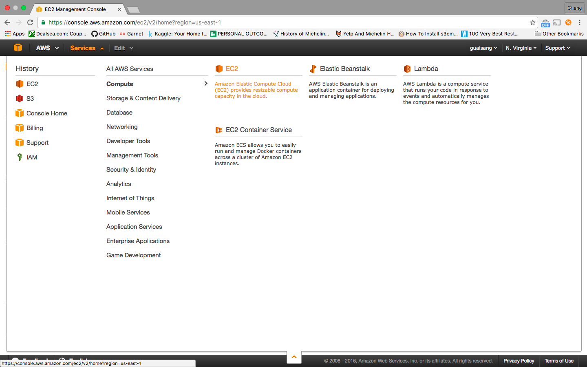

Launch instance here:
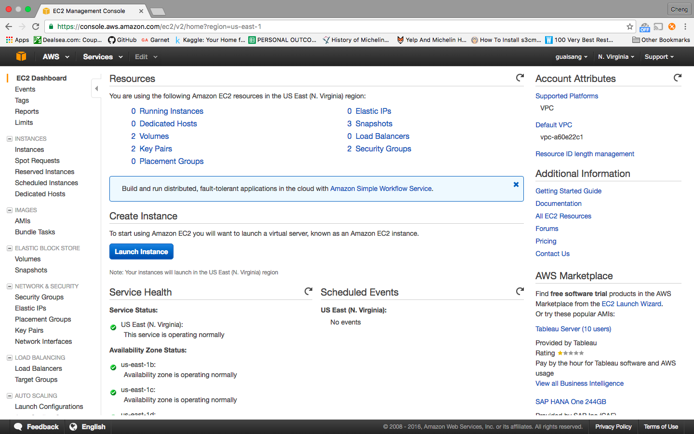

Next, follow the AWS instruction step by step. Step 1 is to choose the type (operating system) of your instance. Here we go for Ubuntu:
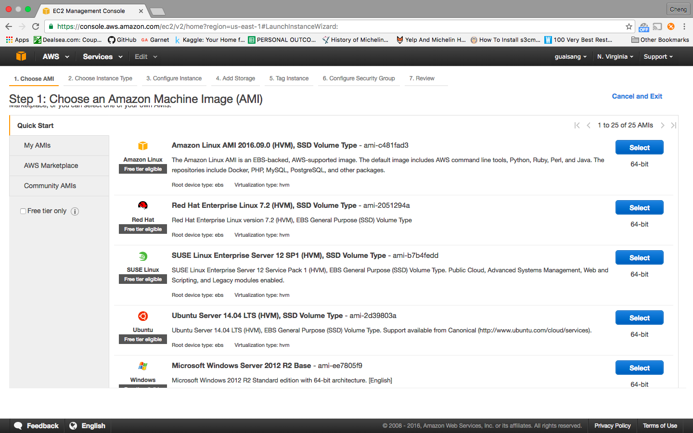

Step 2, choose the hardware configuration of your instance. Here we go for the free one:
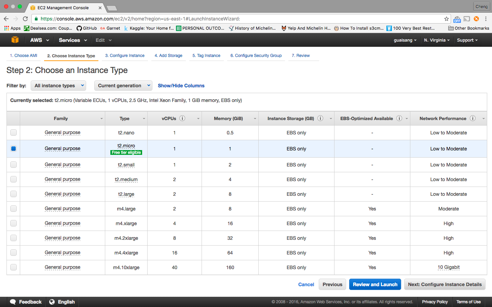

Step 3, configure details. Leave as it is:
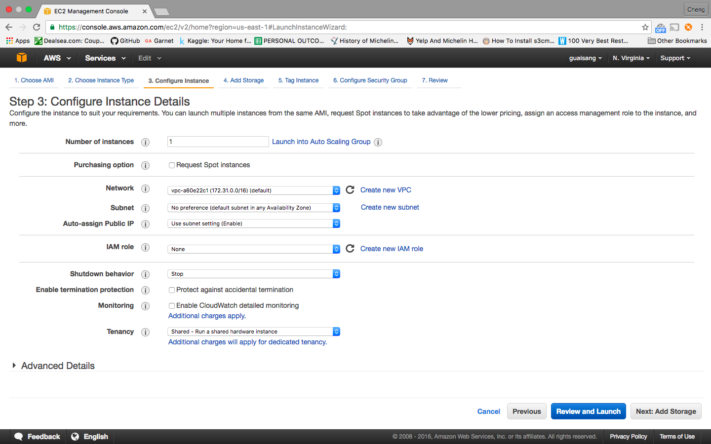

Step 4, add storage. Add storage depending on your dataset. Here we leave as default:
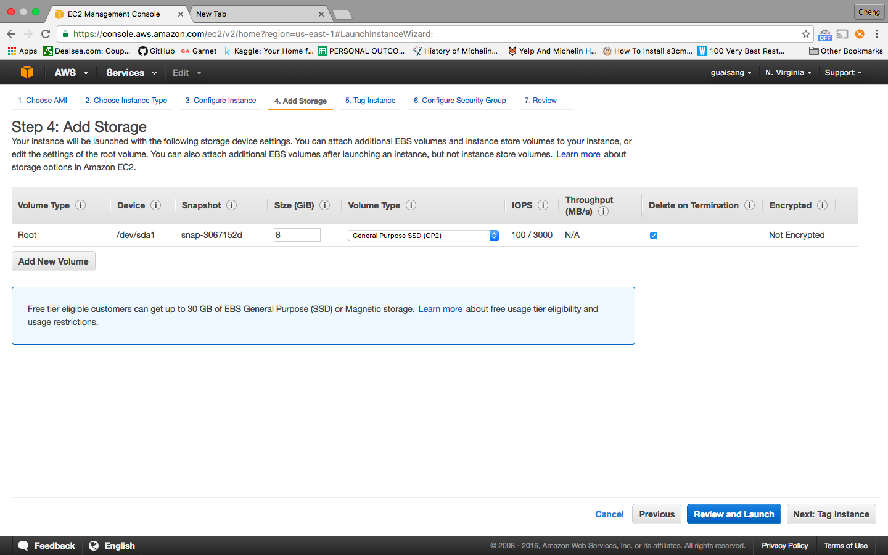

Step 5, Tag instance. Leave as defaut:
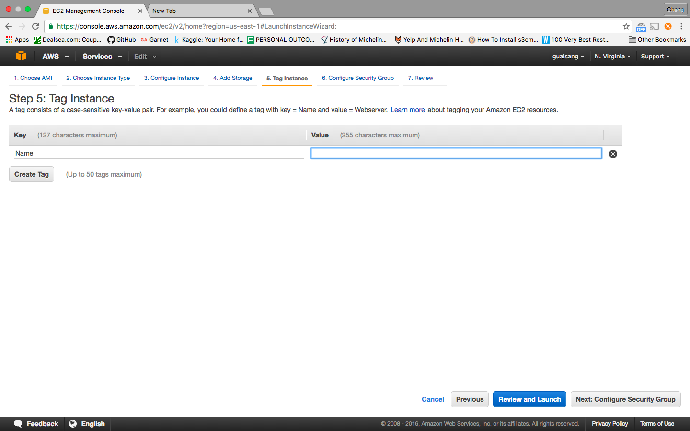

Step 6, configure security group. This is important, as you cannot change it once you launch your instance. Choose 'Create a new security group' and add following rules:
SSH(22): 0.0.0.0/0, HTTPS(443): 0.0.0.0/0, and 8888: 0.0.0.0/0.
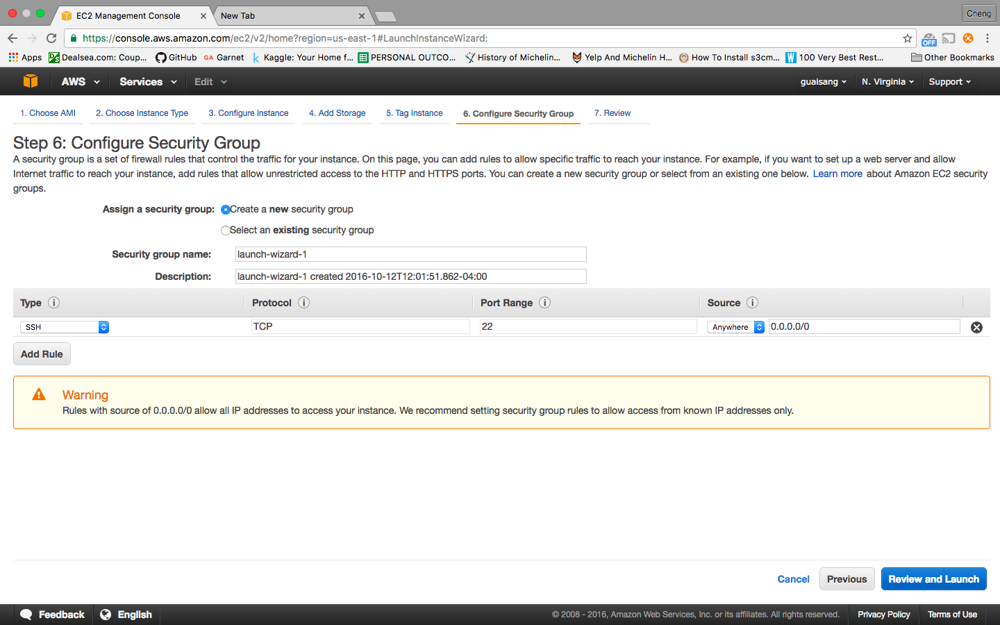

The last step, create a key pair to launch your instance. Select 'Creat a key pair', type in your key pair name as you like, and download it:
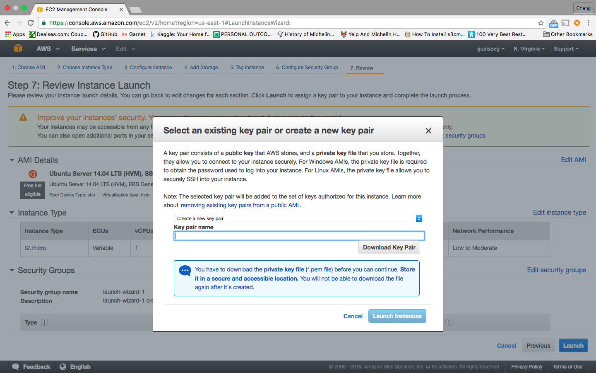

Now you have set up your instance. Let's go ahead and start it:
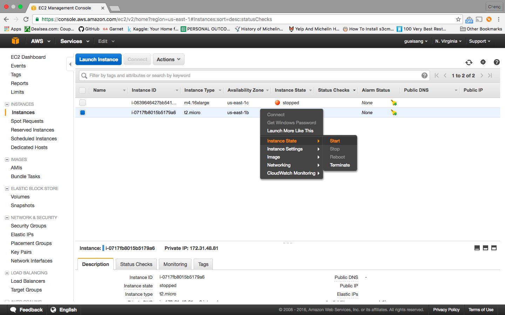

Click 'Connect' and copy this line of commend:
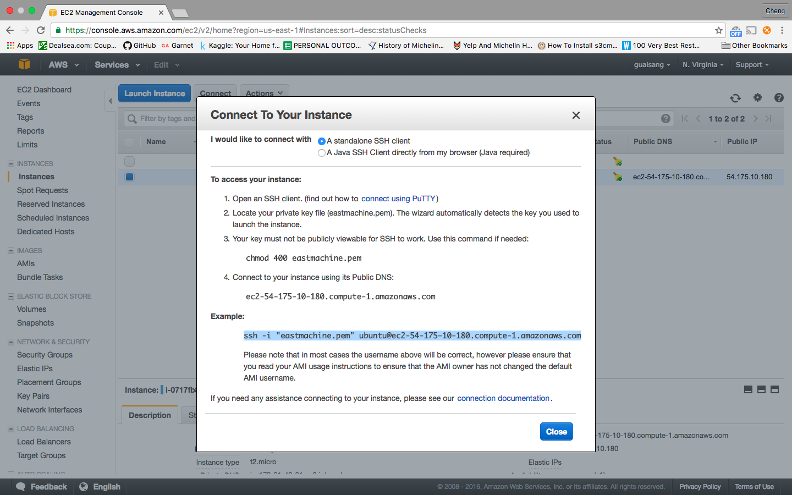

In your terminal, navigate to wherever you store your key pair, and paste the code you just copied. If your terminal looks like this, you are connected:
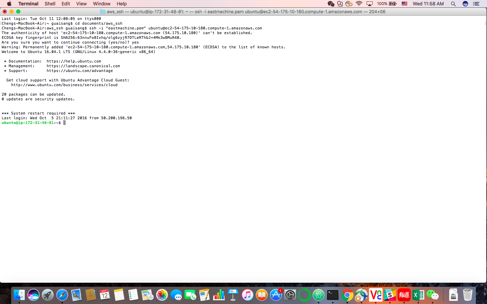

---

#### Set up python environment on EC2
Download Anaconda by typing the following in your terminal:
wget https://repo.continuum.io/archive/Anaconda2-4.2.0-Linux-x86_64.sh.
Then install Anaconda by: bash Anaconda2-4.2.0-Linux-x86_64.sh.
After installation it will ask you if you want to put the folder that was just created at the top of your $PATH. Yes.
Reload your .bashrc by typing: source .bashrc

#### Configure Jupyter Notebook
Type: $ ipython profile create nbserver
Then: $ ipython. Now you should be within ipython. First we are going to create a password for logging Jupyter:

Save the output password starting from 'sha1'

Now we are going to create a self-signed SSL certificate for HTTPS access:
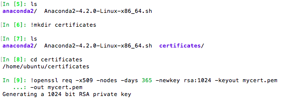

Note we first create a directory, and within the directory we create a pem file by typing: !openssl req -x509 -nodes -days 365 -newkey rsa:1024 -keyout mycert.pem -out mycert.pem

The last step is to modify the jupyter notebook config file:
Type in following:
$ cd ~/.jupyter
$ jupyter notebook --generate-config
$ vim jupyter_notebook_config.py

Within the config file, we need to modify the following lines and uncomment them:
c.NotebookApp.certfile = u'/home/ubuntu/certificates/mycert.pem'
c.NotebookApp.ip = '* '
c.NotebookApp.open_browser = False
c.NotebookApp.password = u'sha1:...(the password you just saved in ipython)'
c.NotebookApp.port = 8888

#### Launch Jupyter
Now it's time to launch Jupyter notebook.
Type: jupyter notebook
Then open your browser, copy your instance's public DNS from your aws EC2 website and go to https://your-Instance-public-DNS:8888.
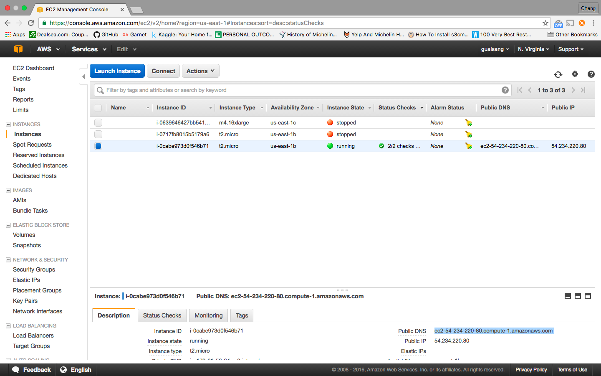

There will be a warning, that's fine. Advance and type in the password you set up in ipython. Boom! You are all set!

---

#### Transfer files between EC2 and S3
Transferring files between S3 and your local machine is relatively simple and straightforward. Everything can be done on the website with clicks. Follow this official tutorial if you have troubles: https://aws.amazon.com/getting-started/tutorials/backup-files-to-amazon-s3/.

The tricky part is how to transfer files between EC2 and S3 once you have your files in your S3 bucket. We are going to do it by using a package called s3cmd.
First, install the package by typing in: $ sudo apt-get install s3cmd
Next, we need to configure s3cmd environment before we can use it. In order to do so, we would need the Access Key and Secret Key of our S3 account, which can be downloaded from the Security Credential page:
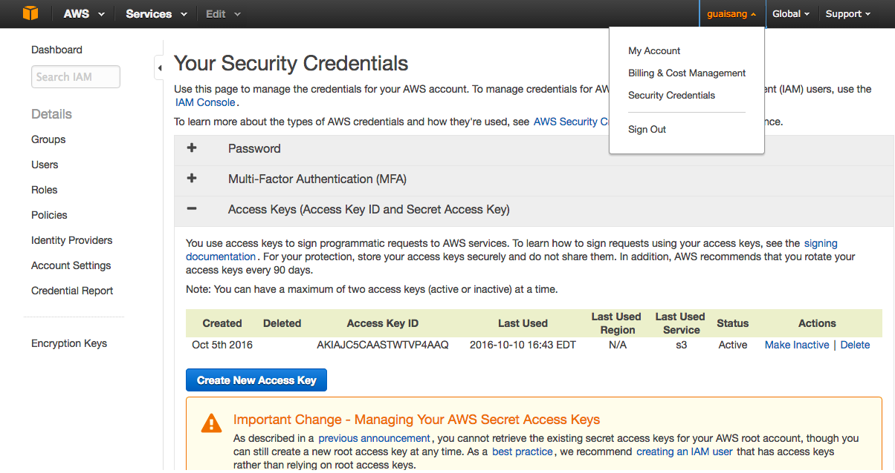

Once you have it, in your terminal type: s3cmd --configure. Put in your Access Key and Secret Key, and then do the following:
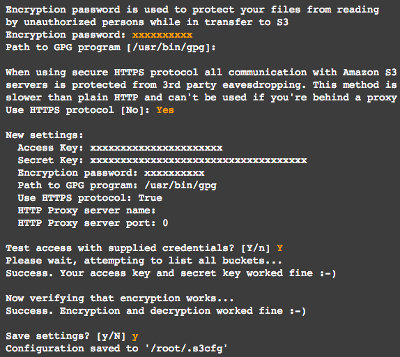

Now you are able to use s3cmd.
To check your bucket: s3cmd ls
To upload files from EC2 to S3: s3cmd put filename s3://bucketname/
To download files from S3 to EC2: s3cmd get s3://bucketname/filename

Ok, now you have your python and data ready, you can start to do your data science on AWS! Oh one last thing, if you keep losing connection to AWS when you are running your code that takes a bit long time, try to add the following into ~/.ssh/config file on your local machine:
Host *
ServerAliveInterval 120
This will send an alive message to the server every 120 seconds to keep you connected.

---

### Expedia User Behavior Prediction
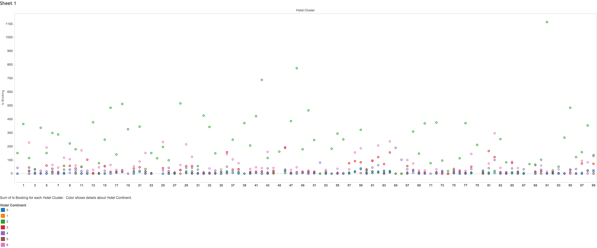

The goal of this project is to predict Expedia user behavior based on the information of previous user activities and characteristics. Specifically, I was predicting which types of hotels users are going to book using information about what users searched for, how they interacted with search results (click/book), whether or not the search result was a travel package, etc. The data is from Expedia, with over 37 million rows and 24 columns.

Features included in the dataset are: date_time, site_name, posa_continent (ID of continent associated with site_name), user_location_country, user_location_region, user_location_city, orig_destination_distance, user_id, is_mobile (1 when a user connected from a mobile device, 0 otherwise), is_package (1 if the click/booking was generated as a part of a package (i.e. combined with a flight), 0 otherwise), channel (ID of a marketing channel), srch_ci (Checkin date), srch_co, srch_adults_cnt, srch_children_cnt, srch_rm_cnt, srch_destination_id, srch_destination_type_id, hotel_continent, hotel_country, hotel_market, is_booking, cnt (Numer of similar events in the context of the same user session), hotel_cluster (dependent variable).

In this project, I used AWS EC2 and S3 services to handle big dataset, conduct missing value imputation, data visualization, feature selection, model selection and model optimization. Random Forest Regressor / Classifier, Boosting, and Neural Network were built and optimized to solve this problem.
